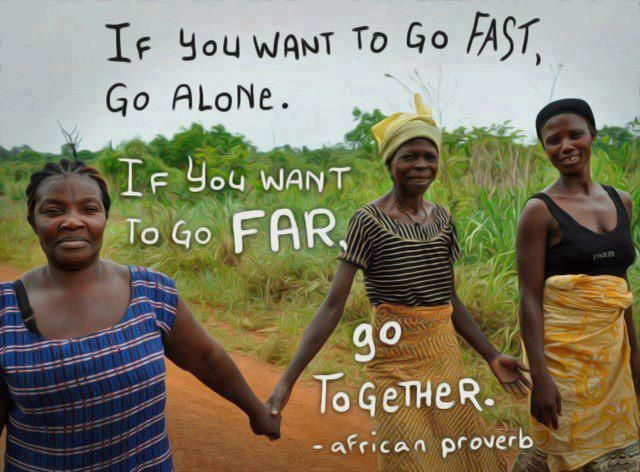
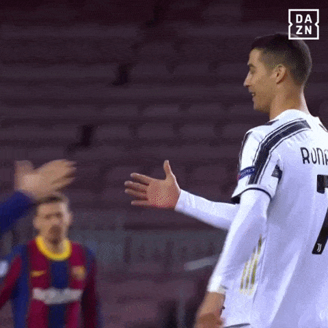
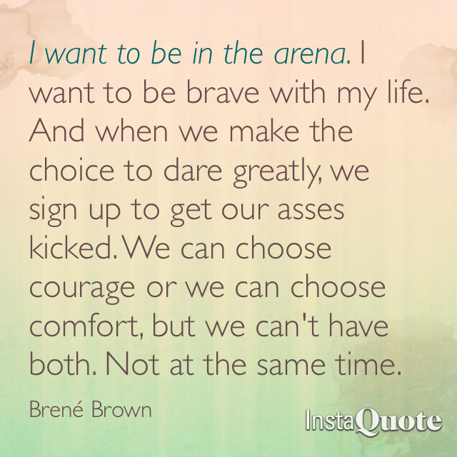

# About me
Yes, hello and welcome to the "find out" phase.

## My philosophy

Ever since about the age of 16 I've realized I find fulfillment in the relationships and connections have the opportunity to build with others. In high school the subject I excelled in was Spanish and I don't think its because I'm any better at learning a foreign language than anyone else, its because I enjoyed learned learning about a different culture while learning a new language.

In the workplace I derive the same fulfillment forging healthy, authentic relationships built on trust. Because I care about those I work with, I believe in giving honest, timely feedback. I hope those I work with feel the same and are willing to the return the favor.

I believe in bringing my full self to work and creating safe spaces where others can do the same. It is my belief that strong teams build upon a foundation of trust can accomplish almost anything. Something I strive to instill in team cultures is the African proverb, "If you want to go fast, go alone. If you want to go far, go together.".

## My CliftonStrengths
- **Woo (Winning Others Over)** - People exceptionally talented in the Woo theme love the challenge of meeting new people and winning them over. They derive satisfaction from breaking the ice and making a connection with someone.
- **Communication** - People exceptionally talented in the Communication theme generally find it easy to put their thoughts into words. They are good conversationalists and presenters.
- **Developer** - People exceptionally talented in the Developer theme recognize and cultivate the potential in others. They spot the signs of each small improvement and derive satisfaction from evidence of progress.
- **Includer** - People exceptionally talented in the Includer theme accept others. They show awareness of those who feel left out and make an effort to include them.
- **Positivity** - People exceptionally talented in the Positivity theme have contagious enthusiasm. They are upbeat and can get others excited about what they are going to do.

## My role

I like to think of myself as a coach of a Premiere league team (a blend of Ted Lasso & Coach Beard). I will defend and protect you all from outside attackers, but I expect everyone to be good sports win or lose...*OR TIE!*

My primary role is to help the team achieve the best outcomes we are capable of. I enjoy bringing a mix of helping team members become the best version of themselves, and getting involved in the tactical work like system, architecture and process design. I work to create a safe environment for everyone (no exceptions), challenge ideas, identify strengths and weaknesses and collaborate on ways to overcome them. My expectation is everyone on the team is more interested in getting it right than being right. There is no room for ego on my team. **There is no room for bullies on this team.** If someone is doing really well on the team, we should all celebrate that person's work! If you're doing really well, we will also celebrate you! If you need to constantly be in the limelight **at the expense of others**, then you may want to reconsider if this is the best fit for you.

My role as the EM on this team is to:

- trust you to do your job
- unblock you
- provide you with a safe environment to grow into a well-rounded human
- give you timely feedback, both good and constructive
- get you the resources you need
- challenge you in ways that will help you grow
- champion your accomplishments to anyone who will listen (and even those who won't)

My role is not to:

- do your job for you
- enable destructive behaviors

You do have to meet me halfway. I will be your biggest cheerleader, but I can't be everywhere at once! I am acutely aware of the fact that heirarchy creates blindspots meaning I can't possibly be aware of every bit of nuance. Even in cases where it initially stings, I am always grateful of candid feedback and helping me uncover blindspots. The book Creativity Inc. describes this as uncovering the unseen

Sometimes I'll ask you to write down what you're doing to help me out. Sometimes it's because I legit have too many things to focus on and I need an easy way to recall all the amazing things that you've done lately. Help me help you get more money!

## What do I value most?

I value doing the right thing even when its hard or when no one is looking.

I value genuine efforts to improve over using the "correct" words all the time.

I value the safety of the marginalized over the hurt feelings of the privileged.

I value that all people are different people.

I value context and transparency.

I value consent and boundaries.

I value collaboration and clear communication over ego (including my own).

I value sustainable work/life equilibrium.

I value progress over perfection.

I value pragmatism.

I value failure so long as we learn from it.

I value emotional labor.

I value being curious, not judgemental.

I value having fun! Aside from our families we spend more time with our co-workers than anyone, we should enjoy our time together as much as we can.

I value choosing to live life in the arena over the cheap seats.

I understand that it can be difficult to trust a new manager. You've probably been burned before! But hopefully laying out my values can help you understand where I'm coming from. I will always tell you as much information as I know and am able to tell you and work with you to understand the context behind decisions. I will always care about you as a person and your wellbeing. My values are the most important thing to me.

## Things I'm working on

As much as I like to think I'm a robot who will live forever without feelings, I often fail pretty hard. Some known failure modes I have are:

- overcommitting to events and burning out
- getting overwhelmed at social events (I am an introvert after all)
- forgetting to do self-care
- not liking being told what to do (asking questions has a much better success rate)

Ways I'm working on these:
- regularly going to therapy
- regularly going to the gym
- actively working on [closing the stress cycle](https://www.amazon.com/Burnout-Secret-Unlocking-Stress-Cycle-ebook/dp/B07DT4GW16/ref=tmm_kin_swatch_0?_encoding=UTF8&qid=1567181581&sr=8-1)
- [photography](https://instagram.com/danielleleongphoto)
- limiting the number of extracurricular activities I do
- regularly taking time off
- limiting social media usage

Ways you can help!
- remind me to take breaks (I always appreciate this)
- remind me to delegate
- give me some space if it looks like it's That Kind of Day
- snacks. Snacks are always appreciated (savory preferred). Or coffee/tea.
- start with questions and context - I always value learning about your understanding of a situation so that we can be on the same page
